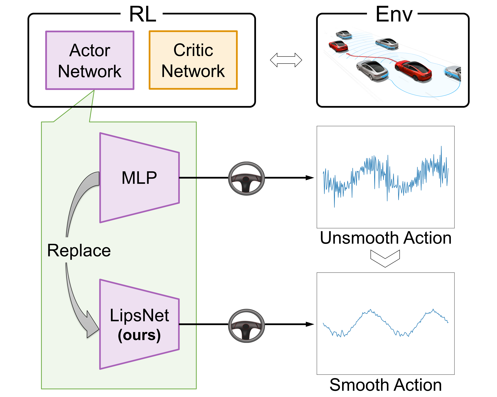

# LipsNet
This is a **PyTorch** implementation of LipsNet.

The paper is accepted at **ICML 2023** with the title '***LipsNet: A Smooth and Robust Neural Network with Adaptive Lipschitz Constant for High Accuracy Optimal Control***'.

Links: [[**Paper**](https://proceedings.mlr.press/v202/song23b.html)], [[**Poster**](https://github.com/jerry99s/LipsNet/blob/main/materials/poster.pdf)].



LipsNet can serve as **actor networks** in most **actor-critic reinforcement learning** algorithms, in order to reduce the action fluctuation.
A low level of action fluctuation will protect mechanical components from the wear and tear, and reduce safety hazards.

The overall structure is shown below:


## Requirements
The **version of PyTorch** should be higher than 1.11 and lower than 2.3,
as we incorporate *functorch.jacrev* and *functorch.vmap* methods.

## How to use
We package LipsNet as a **PyTorch module**.

Practitioners can **easily use** it just like using MLP.

```
from lipsnet import LipsNet

# declare
net = LipsNet(...)

# training
net.train()
out = net(input)
...
loss.backward()
optimizer.step()
optimizer.zero_grad()
net.eval()

# evaluation
net.eval()
out = net(input)
```

More details can be found in *lipsnet.py*.

## Reference
```
@InProceedings{pmlr-v202-song23b,
  title = {LipsNet: A Smooth and Robust Neural Network with Adaptive Lipschitz Constant for High Accuracy Optimal Control},
  author = {Song, Xujie and Duan, Jingliang and Wang, Wenxuan and Li, Shengbo Eben and Chen, Chen and Cheng, Bo and Zhang, Bo and Wei, Junqing and Wang, Xiaoming Simon},
  booktitle = {Proceedings of the 40th International Conference on Machine Learning},
  pages = {32253--32272},
  year = {2023},
  volume = {202},
  series = {Proceedings of Machine Learning Research},
  month = {23--29 Jul},
  publisher = {PMLR}
}
```